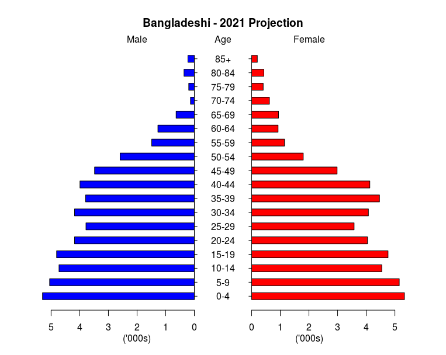
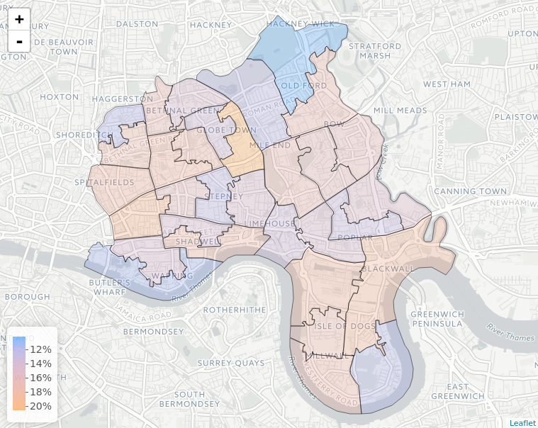

# Microsimulation for Demography Examples

[](https://travis-ci.org/virgesmith/demographyMicrosim)
[](http://www.gnu.org/licenses/gpl-3.0.html) 
[](https://zenodo.org/badge/latestdoi/97580490)

This repo contains material to accompany the article '[Microsimulation for Demography](http://www.australianpopulationstudies.org/index.php/aps/article/view/14)' in _Australian Population Studies_.

## The Examples

In the the first example we microsynthesise a base human population for the London Borough of Tower Hamlets from 2011 census data, modelling a population in terms of their geographical location, gender, age and ethnicity.

In the second example we take the synthetic population from the first step and microsimulate its evolution using detailed ethnicity-specific fertility and mortality data.

Thirdly we demonstrate ways to visualise aspects of the resulting data, such as age distribution, diversity, and population growth.

In the following sections we first give a detailed description of data and methodology, followed by step-by-step usage instructions, and some example illustrations from the results.

## Package Overview

The package is self-contained in that it contains all the code and input data needed for the microsimulation. 

### Input data
The input data consists of three distinct datasets, which are used (respectively) for the microsynthesis, the microsimulation, and the visualisation. They are described in more detail in the following sections.
 
#### Aggregate Population Data

This data is used to generate a synthetic population.

The population aggregate data is 2011 UK census data sourced from [nomisweb](https://www.nomisweb.co.uk), for the London Borough of Tower Hamlets at middle-layer super output area (MSOA) resolution. MSOA corresponds to a subregion containing approximately 8,000 people. Tower Hamlets is split into 32 MSOAs and its total population is recorded as just over 250,000.

For the purposes of this worked example we have preprocessed the census data into the following csv files:

- [sexAgeEth.csv](data/sexAgeEth.csv) - count of persons by MSOA by sex by age band by ethnicity
- [sexAgeYear.csv](data/sexAgeYear.csv) - count of persons by MSOA by sex by single year of age

#### Categories:
- MSOA: ONS code for the 32 MSOAs within Tower Hamlets
- Sex: M/F
- Age Band: 0-4, 5-7, 8-9, 10-14, 15, 16-17, 18-19, 20-24, 25-29, 30-34, 35-39, 40-44, 45-49, 50-54, 55-59, 60-64, 65-69, 70-74, 75-79, 80-84, 85+
- Age: individual years up to 84, then a single 85+
- Ethnicity: BAN (Bangladeshi), BLA (Black African), BLC (Black Caribbean), CHI (Chinese), IND (Indian), MIX (Mixed), OAS (Other Asian), OBL (Other Black), OTH (Other), PAK (Pakistani), WBI (White British), WHO (White Other)

NB The categories for Ethnicity have been reduced slightly from the original census categories in order to be consistent with the fertility/mortality data.

#### Fertility/mortality rate data

Fertility and mortality rate data is provided by the [NewETHPOP](http://www.ethpop.org) project, and gives rates by gender (mortality only), ethnicity and single year of age, for the entire borough, but does not differentiate on any smaller geographical scale. 

There is significant variation in the rates for different ethnicities, and it is important that our microsimulation captures this.

- [TowerHamletsFertility.csv](data/TowerHamletsFertility.csv) - annual fertility rate for (female) persons by age and ethnicity
- [TowerHamletsMortality.csv](data/TowerHamletsMortality.csv.csv) - annual mortality rate for persons by gender by age and ethnicity

#### Geographical Data

The boundary data is sourced from [ONS](https://www.ons.gov.uk/methodology/geography/geographicalproducts/digitalboundaries) data consists of shapefiles for the 32 MSOAs within Tower Hamlets, and is purely for geographic visualisation of the microsimulation results.

### Methodology

#### Microsynthesis 

* `microsynthesise()` - takes the input data (population aggregates) and synthesises an individual "base" population. 

In this example, microsynthesis is necessary due to the fact that we have fertility/mortality rates for a single year of age, and census data does not give us ethnicity by single year of age. Using microsynthesis, we can generate a synthetic population that enumerates both ethnicity and single year of age for every individual. Moreover, this population is entirely consistent with the input data: it will match both the ethnicity totals (by age band) and the population totals (by single year of age) for each geographical area and gender. 

For the microsynthesis we use the humanleague R package that generates a population using quasirandom sampling of the marginal data.

The algorithm has three broad functional components:
1. load the input data and compute various data that will be required later (such as the categories, .and a mapping between age band and age)
2. perform microsyntheses for each geographical area and insert into the the population.
3. perform checks on the synthesised population to ensure it is consistent with the input data.

See [microsynthesis.R](R/microsynthesis.R) for more detail.

#### Microsimulation
- `microsimulate()` - takes the microsynthesised data from above, then uses more input data (fertility/mortality rates) to project the population. 

In this example we project the base population from 2011 to 2021. The methodology is a Monte-Carlo simulation that assign births and deaths to the population based on the age- and ethnicity-specific fertility and mortality rates supplied. The simulation is discrete in that it operates in one-year intervals, and the user specifies the number of years to run for. 

Whilst there are more efficient ways of projection for this simple example, the aim here is to illustrate the process. Note that the following assumptions are made:

- only single births occur (i.e. we assume that multiple births are factored into the fertility rate).
- newborn have an equally probable chance of being male or feamle.
- the ethnicity and MSOA of the newborn is the same as their mother's
- births occur before deaths - thus a newborn will survive if a parent dies within the same year
- migration is not taken into account. See final section.

The algorithm can be qualitatively described as follows:
1. load the ethnicity-specific fertility and mortality rates
2. randomly assign births and deaths to members of the population in a manner that is consistent with the fertility and mortality rates.
3. age the population by one year.
4. insert newborns (aged zero) and remove the deceased from the population. 
5. repeat from step 2 until the target year is reached.

See [microsimulation.R](R/microsimulation.R) for more detail. NB This computation is time-consuming partly because the code has not been optimised for the sake of readability.

#### Visualisation

* `pyramid()` - generates a pyramid plot by age band and gender for members of the population of a specific ethnicity. See [graph.R](R/graph.R) for details.
* `map()` - geographic visualisations of data derived from the microsyntheses. See [map.R](R/map.R) for details. 
* `diversity()`, `growth()` - helper functions for calculating growth and diversity coefficients. See [utils.R](R/utils.R) for details. 

## Using the Package

### Installation

This R package should be installed directly from github. We recommend the use of the most recent version of RStudio and users will need sufficient admin privileges to install packages. 

Firstly, if not already installed, you will need the `devtools` package to install packages from github.

```
> install.packages("devtools")
```

There is a dependency on another github package `humanleague`, version 1.0.1, which should be installed first. The following commands will install the both packages:
```
> devtools::install_github("virgesmith/humanleague@1.0.1")
> devtools::install_github("virgesmith/demographyMicrosim")
```
There are also dependencies on some standard R packages, which should automatically install by default. If for some reason they don't they can also be manually installed like so:
```
> install.packages(c("data.table", "sf", "plotrix", "leaflet"))
```

### Step 1 - Static microsynthesis

Load the package and call the `microsynthesise()` function to generate a base population:
```
> library(demographyMisrosim)
> basePopulation = microsynthesise()
Population:  254096 
Starting microsynthesis...done
Checking consistency of microsynthesised population...done
```
This will take around 1 minute, depending on the hardware used. We can save this population for later use:
```
> write.csv(basePopulation, "basePopulation.csv", row.names=FALSE)
```
(The final argument stops R from inserting an index column into the saved data, which we do not require.) 

NB when loading pre-saved data, it must be loaded as a data.table (as opposed to the default data.frame) in order to work correctly, e.g.
```
> basePopulation = as.data.table(read.csv("basePopulation.csv", row.names=FALSE))
```
### Step 2 - Microsimulation (Projection)

Assuming you have already carried out the microsynthesis step above, we can project the population 10 years forward to 2021 using the following:
```
> population2021=microsimulate(basePopulation, 10)
base population: 254096 
Projecting: T+1...done
T+1 population 258286
Overall simulation time(s):  0.499080896377563 
Projecting: T+2...done
T+2 population 262500
Overall simulation time(s):  1.24033451080322 
Projecting: T+3...done
T+3 population 266477
Overall simulation time(s):  1.96326041221619 
Projecting: T+4...done
T+4 population 270454
Overall simulation time(s):  2.60470032691956 
Projecting: T+5...done
T+5 population 274550
Overall simulation time(s):  3.25180697441101 
Projecting: T+6...done
T+6 population 278437
Overall simulation time(s):  3.92754030227661 
Projecting: T+7...done
T+7 population 282347
Overall simulation time(s):  4.7733268737793 
Projecting: T+8...done
T+8 population 286290
Overall simulation time(s):  5.45123076438904 
Projecting: T+9...done
T+9 population 289911
Overall simulation time(s):  6.21706819534302 
Projecting: T+10...done
T+10 population 293501
Overall simulation time(s):  6.9142210483551 
```
The projection for 10 years ~may take two hours or more depending on hardware, so it's definitely worth saving this population for later use~ is now vectorised and runs hundreds of times faster, but the results can be saved like so:
```
> write.csv(population2021, "population2021.csv", row.names=FALSE)
```

### Step 3 - Visualising the Results
The package provides convenient functions for generating graphs. For example, to reload the population projection and view the projected 2021 Bangladeshi population as a pyramid plot:
```
> population2021 = as.data.table(read.csv("population2021.csv", stringsAsFactors = FALSE))
> pyramid("BAN", population2021)
```
Which should look like this:



_Figure 1. 2021 Projected Bangladeshi population._

We can also now compute some summary statistics from the population to help us understand the population and how it has evolved.

```
> div = diversity(population2021)
> grth = growth(basePopulation, population2021)
```
Either of which can be visualised on a map using the `map` function, e.g.
```
> map(grth)
```
Which results in

 
###### Map tiles by Carto, under CC BY 3.0. Data by OpenStreetMap, under ODbL  
_Figure 2. Map of projected population growth 2011-2021. (Percentages are not annualised.)_

It should be noted that the microsimulation is essential to arrive at a result like this - given only fertility and mortality data for the whole borough, we have been able to model growth at a higher geographical resolution thanks to the finer detail provided by census data, namely populations by ethnicity within each MSOA. 

## Taking it Further
This projection omits crucial factors (most notably migration) in order to keep the worked example fairly simple, and the results presented here should not be considered realistic. We hope that it provides a useful overview of some of the techniques and how they can be applied to demographics.

Readers are encouraged to clone this repo, adapt/extend it for their own use and/or improve it. Pull requests are welcomed!

## References

LOMAX, Nik; SMITH, Andrew. Microsimulation for demography. Australian Population Studies, [S.l.], v. 1, n. 1, p. 73-85, nov. 2017. ISSN 2208-8482
